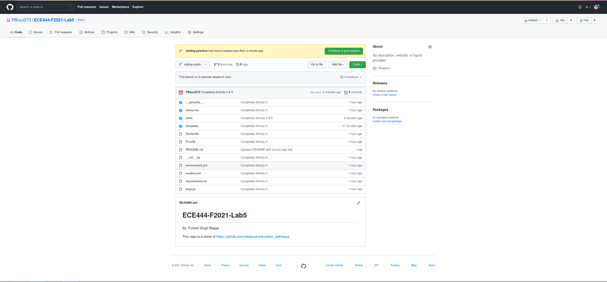
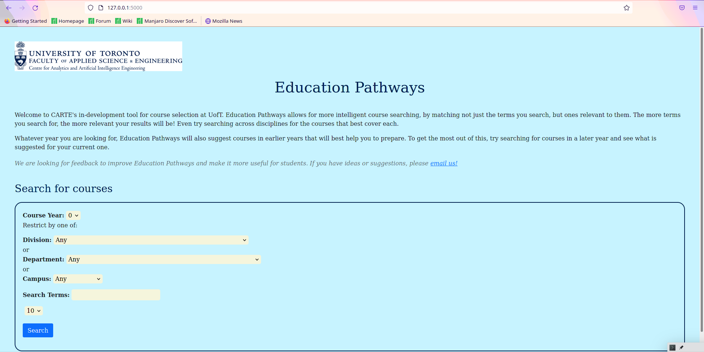
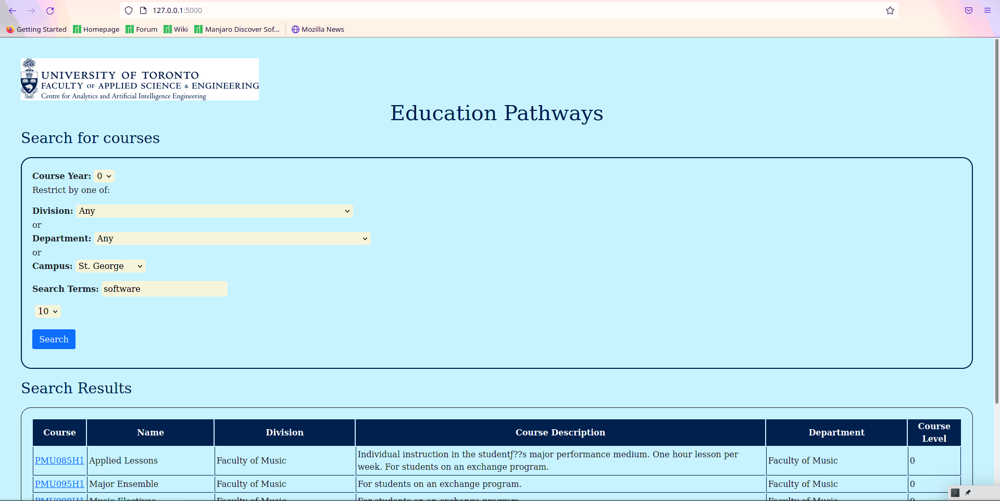
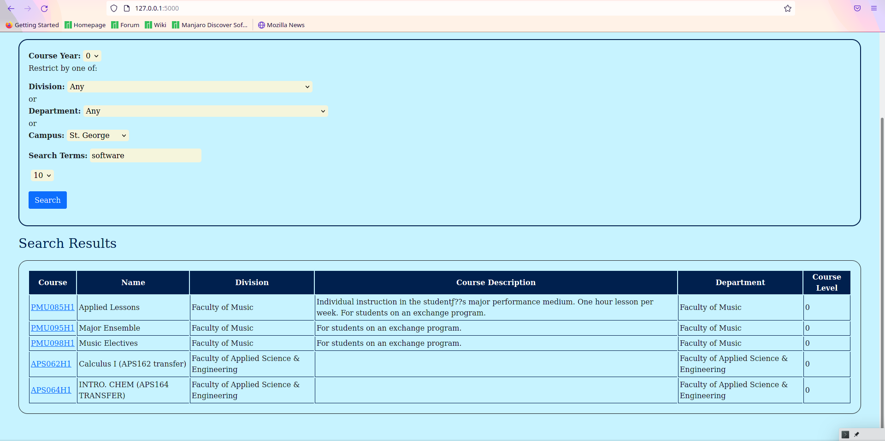

# ECE444-F2021-Lab5
By: Puneet Singh Bagga

This repo is a clone of https://github.com/nelaturuk/education_pathways.

## Activity 1

## Activity 2-5

### Home Page

### Results Page - Form

### Results Page - Results Table

## Activity 6
The old UI and the new UI are worlds apart in terms in their designs. The new UI is properly formatted and easier on the eyes, also scales well to new browser orientations. The new UI's background colour is too much, the white on the old UI was much easier to read with (too much strain with blue). With the new formatting its easier to see how to do things (with the borders and line breaks), its also much more clean making it more appealing to the eyes. 
